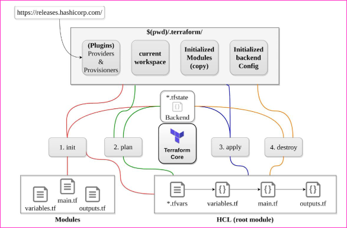

### 1.What are the most useful Terraform commands?

* Common commands:
    * terraform init: Prepare your working directory for other commands
    * terraform plan: Show changes required by the current configuration
    * terraform apply: Create or update infrastructure
    * terraform destroy: Destroy previously-created infrastructure

### 2.How does Terraform help in discovering plugins?

* Terraform interprets configuration files in the operational directory with the authority “Terraform init”, 
* Then, Terraform determines the necessary plugins and searches for installed plugins in various locations. 
* Terraform may also download additional plugins at times. 
* Then it decides which plugin versions to use and creates a security device file to ensure that Terraform uses the same plugin versions.

### 3.Can I add policies to the open-source or pro version of Terraform enterprise?

* Terraform Policies cannot be added to Terraform Enterprise’s open-source description. 
* The same is true for the Enterprise Pro edition. 
* Terraform Enterprise’s best version could only contact the watch policies.

### 4.Define Modules in Terraform?

* A module in Terraform is a container for multiple resources that are used in tandem. 
* Every Terraform that includes resources mentioned in.tf files requires the root module.

### 5.What are the ways to lock Terraform module versions?

* You can use the terraform module registry as a source and specify the attribute’version’ in the module in a terraform configuration file. 
* If you are using the GitHub repository as a source, you must use ‘? ref’ to specify the branch, version, and query string.

### 6.What do you mean by Terraform cloud?

* Terraform Cloud is an application that enables teams to use Terraform collaboratively. 
* It manages Terraform runs in a consistent and reliable environment, and includes features such as easy access to shared state and secret data, access controls for approving infrastructure changes, a private registry for sharing Terraform modules, detailed policy controls for governing the contents of Terraform configurations, and more.

### 7.Define null resource in Terraform?

* The null resource follows the standard resource lifecycle but takes no additional actions. 
* The trigger argument allows for the specification of a subjective set of values that, if misrepresented, will cause the reserve to be replaced.
* The null resource’s primary application is as a do-nothing container for arbitrary actions performed by a provisioner.

### 8.Can Terraform be used for on-prem infrastructure?

* Yes, Terraform can be used to build on-premises infrastructure. There are numerous providers available. 
* You can select whichever one best suits your needs. Many people create client Terraform providers for themselves; all that is required is an API.

### 9.What does the following command do?

* Terraform -version – to check the installed version of terraform
* Terraform fmt– it is used to rewrite configuration files in canonical styles and format
* Terraform providers – it gives information of providers working in the current configuration.

### 10.List all the Terraform-supported versions

* GitHub.com
* GitLab.com
* GitHub Enterprise
* GitLab CE and EE
* Bitbucket Cloud and Server
* Azure DevOps Server and Services

### 11.Explain the command terraform validate in the context of Terraform.

* The terraform validate command examines the configuration files in a directory, concentrating solely on the configuration and ignoring any external services such as remote state, provider APIs, and so on. 
* Validate inspects a configuration to determine whether it is syntactically correct and internally consistent, regardless of variables or current state. 
* As a result, it’s best for general reusable module verification, such as confirming the validity of attribute names and value types. This command can be executed automatically, such as a post-save check in a text editor or a test step in a continuous integration system for a reusable module.

### 12.Mention some of the version control tools supported by Terraform.

* Version control tools supported by Terraform are:
    * GitHub
    * GitLab CE
    * GitLab EE
    * Bucket Cloud

