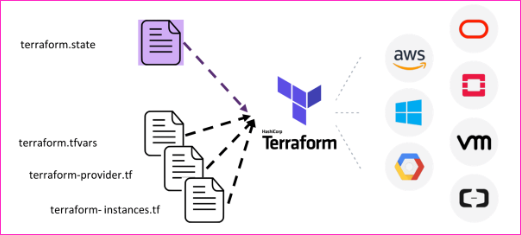

### What Is Terraform Automation?

* Terraform is a tool to build an infrastructure safely and efficiently. Terraform can manage leading and popular service providers as well as custom in-house solutions.

* The Configuration file in Terraform describes the components needed to run a single application or your entire Datacenter. 
* Terraform then generates an execution plan describing what it will do to reach the desired state, and then executes it to build the described infrastructure. 
* It creates incremental execution plans which can be applied according to the configuration change.

* The infrastructure Terraform can manage includes low-level components such as compute instances, storage, and networking, as well as high-level components such as DNS entries, SaaS features, etc.

### Why You Should Learn About Terraform?

* Terraform is an open-source, Cloud-agnostic provisioning tool that supported Immutable Infrastructure, a Declarative language, a masterless and Agentless Architecture, and had a large community and a mature codebase.

* Infrastructure is described using a high-level configuration syntax. This allows a blueprint of your datacenter to be versioned and treated as you would any other code. 
* Additionally, Infrastructure can be shared and re-used.

* Terraform builds a graph of all your resources, and parallelizes the creation and modification of any non-dependent resources. 
* Because of this, Terraform builds infrastructure as efficiently as possible, and operators get insight into dependencies in their infrastructure.

* Terraform has a “Planning” step where it generates an execution plan. The execution plan shows what Terraform will do when you call apply. 
* This lets you avoid any surprises when Terraform manipulates Infrastructure.

* Complex changesets can be applied to your infrastructure with minimal human interaction. 
* With the previously mentioned execution plan and resource graph, you know exactly what Terraform will change and in what order, avoiding many possible human errors.

### Why Terraform?

* Terraform is a tool to build an infrastructure safely and efficiently. Terraform can manage leading and popular service providers as well as custom in-house solutions.

* The Configuration file in Terraform describes the components needed to run a single application or your entire data centre. 
* Terraform then generates an execution plan describing what it will do to reach the desired state, and then executes it to build the described infrastructure. 
* It creates incremental execution plans which can be applied according to the configuration change.

