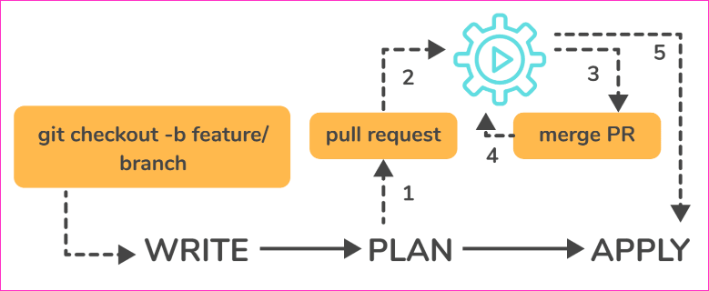
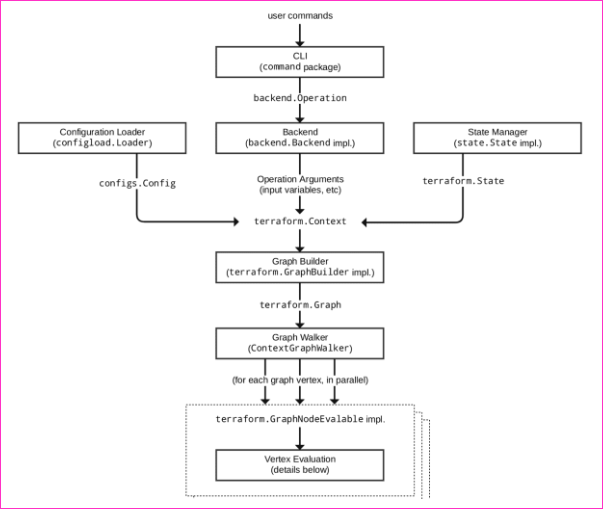
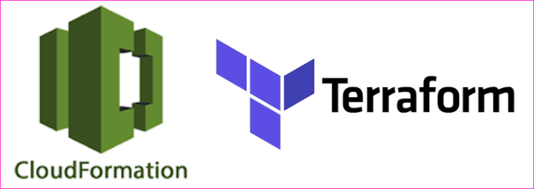
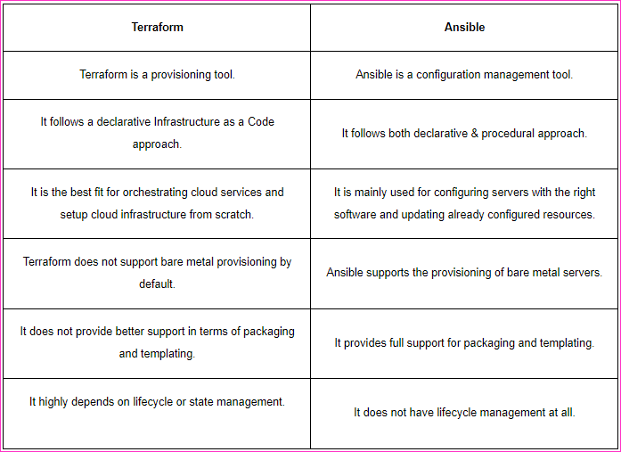
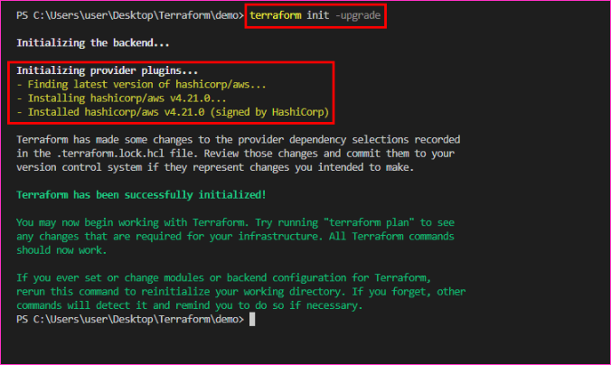

### 1.How would you recover from a failed apply in Terraform?

* You can save your configuration in version control and commit it before making any changes, and then use the features of your version control system to revert to an earlier configuration if necessary. 
* You must always recommit the previous version code in order for it to be the new version in the version control system.

### 2.What do you mean by Terragrunt, list some of its use cases?

* Terragrunt is a lightweight wrapper that adds tools for maintaining DRY configurations, working with multiple Terraform modules, and managing remote states.
* Use cases:
    * Keep your Terraform code DRY
    * Maintain a DRY remote state configuration.
    * Keep your CLI flags DRY
    * Run Terraform commands on multiple modules at the same time.
    * Use multiple AWS accounts.

### 3.What steps should be followed for making an object of one module to be available for the other module at a high level?

* The following are the steps to take in order to make an object from one module available to the other module at a high level:
    * First, in a resource configuration, an output variable must be defined. The scope of local and to a module is not declared until you declare resource configuration details.
    * You must now declare the output variable of module A so that it can be used in the configurations of other modules. 
    * You should create a brand new and current key name, and the value should be kept equal to the module A output variable.
    
    * You must now create a file variable.tf for module B. 
    * Create an input variable inside this file with the same name as the key you defined in module B. 
    * This variable in a module enables the resource’s dynamic configuration. 
    * Rep the process to make this variable available to another module as well. 
    * This is due to the fact that the variable established here has a scope limited to module B.

### 4.What is State File Locking?

* State file locking is a Terraform mechanism that prevents operations on a specific state file from being performed by multiple users at the same time. 
* Once the lock from one user is released, any other user who has taken a lock on that state file can operate on it. 
* This aids in the prevention of state file corruption. The acquiring of a lock on a state file in the backend is a backend operation. 
* If acquiring a lock on the state file takes longer than expected, you will receive a status message as an output.

### 5.What is a Remote Backend in Terraform?

* Terraform remote backend is used to store Terraform’s state and can also run operations in Terraform Cloud. 
* Multiple terraform commands such as init, plan, apply, destroy (terraform version >= v0.11.12), get, output, providers, state (sub-commands: list, mv, pull, push, rm, show), taint, untaint, validate, and many more are available via remote backend. 
* It is compatible with a single remote Terraform cloud workspace or multiple workspaces. 
* You can use terraform cloud’s run environment to run remote operations such as terraform plan or terraform apply.

### 6.What is a Tainted Resource?

* Tainted resources are those that must be destroyed and recreated upon the next apply command. 
* Nothing changes on infrastructure when you mark a resource as tainted, but the state file is updated with this information (destroy and create). 
* After marking a resource as tainted, Terraform plan out will show that the resource will be destroyed and recreated, and the changes will be implemented when the next apply occurs.

### 7.Are callbacks possible with Terraform on Azure?

* Terraform uses Azure Event Hub to perform Azure callbacks. 
* It aids in achieving functionality such as sending a callback to the system and other events. 
* To make the process easier, Terraform AzureRM already includes this functionality.

### 8.How to prevent Error Duplicate Resource

* It can be done in three ways depending on the situation and the requirement
    * By deleting the resource, Terraform code will no longer manage it.
    * By removing resources from APIs
    * Importing action will also aid in resource elimination.

### 9.Explain the workflow of the core terraform.

* Terraform’s core workflow has three steps:
    * Write – Create infrastructure in the form of code.
    * Plan – Plan ahead of time to see how the changes will look before they are implemented.
    * Apply – Create a repeatable infrastructure.

### 10.Explain the architecture of Terraform request flow.

* A request in Terraform undergoes the following steps as shown in the diagram:

>> Command Line Interface (CLI):

* CLI (Common Language Interface) (command package)

* Except for some early bootstrapping in the root package, when a user launches the terraform programme, execution immediately jumps into one of the command package’s “command” implementations (not shown in the diagram). 
* The commands store the mapping between user-facing command names and their corresponding command package types. 
* The go file is located in the repository’s root directory.

* The command implementation’s responsibility for these commands is to read and parse any command line arguments, command-line options, and environment variables required for the specified command and use them to construct a backend. 
* Object of operation The operation is then passed to the currently selected backend.

* Backends:
    * A backend in Terraform is responsible for a number of things:

        * Execute operations (e.g. plan, apply)
        * Variables defined in the workspace can be saved.
        * to store the current state

* The local backend retrieves the current state for the workspace specified in the operation using a state manager (either statemgr.Filesystem if the local backend is used directly, or an implementation provided by whatever backend is being wrapped), and then uses the config loader to load and perform initial processing/validation of the configuration specified in the operation. 
* It then creates a terraform.context object using these parameters as well as the other parameters supplied in the process. 
* The main object performs terraform operations.

>> Configuration Loader :

* Model types represent the top-level configuration structure in package configs. 
* Config represents a configuration (the root module and all of its child modules). 
* Although the configs package contains some low-level functionality for creating configuration objects, the configload is the primary entry point. 
* Loader can be found in the configload subpackage. A loader handles all of the complexities associated with installing child modules (during terraform init) and then locating those modules when a configuration is loaded by a backend. 
* It takes the path to the root module and loads all of the child modules recursively to produce a single configuration.

>> State Manager:

* The state manager is in charge of storing and retrieving snapshots of a workspace’s Terraform state. 
* Each manager implements a subset of the interfaces provided by the statemgr package, with the majority of managers covering the entire set of statemgr. Complete operation. 
* The smaller interfaces are commonly used in other function signatures to specify what actions the function may take on the state manager; there is no reason to create a state manager that does not implement all of statemgr. Full.

>> Graph Builder:

* The terrain. 
* The Context method calls a graph builder. 
* A graph builder is used to represent the fundamental phases of that action, as well as the dependencies between them. 
* Because of the differences in the graph-building process, each operation has its own graph builder. 
* For a “plan” operation, a graph must be constructed directly from the configuration, whereas a “apply” action constructs its graph from the set of alterations mentioned in the plan being applied.

>> Graph Walk:

* The graph walking method explores each vertex of the graph while keeping the graph’s “happens after” edges in mind. 
* Every vertex in the graph is evaluated so that the “happens after” edges are taken into account. 
* The graph walk algorithm will evaluate multiple vertices at once if possible.

>> Vertex Evaluation:

* Execution refers to the action taken for each vertex during a graph walk. 
* Execution performs a set of random operations that are appropriate for the vertex type in question. 
* Before the graph walk can begin evaluating other vertices with “happens after” edges, a vertex must be correctly completed. 
* When one or more errors occur during evaluation, the graph walk is paused, and the errors are returned to the user. 

### 11.Differentiate between Terraform and Cloudformation.

* The following points highlight the differences between Terraform and Cloudformation:

* User-friendliness: Terraform works with a variety of Cloud Service Providers, including AWS, Azure, Google Cloud Platform, and others, whereas CloudFormation only works with AWS services. Terraform covers the vast majority of AWS resources.

* Depending on the language: CloudFormation supports JSON and YAML. CloudFormation is now simple to grasp and apply. 
* AWS developers, on the other hand, are not permitted to create CloudFormation templates larger than 51MB. 
* If the size of a template exceeds this limit, the developers must create a layered stack for it. 
* Terraform, on the other hand, makes use of Hashicorp’s own HCL programming language (Hashicorp Configuration Language). 
* This language is also JSON-compatible.

* State-management: 
    * Because CloudFormation is an AWS managed service, it inspects the infrastructure on a regular basis to ensure that it is in good working order. 
    * If anything changes, CloudFormation receives a detailed response.
    Terraform, on the other hand, stores the state of the infrastructure on the provisioning machine, which can be a virtual machine or a remote computer. 
    * Terraform defines the resources it maintains using the state as a map, which is saved as a JSON file.
    * To summarise, CloudFormation manages Cloudformation’s state by default, preventing conflicting changes. 
    * Terraform saves the state to a local disc, making state synchronisation easier. 
    * Terraform states can also be saved in storage services such as S3, which is a recommended additional state management strategy. 
    * This must be defined on the backend to facilitate and secure management.

* Cost:
    * The best part is that both of these programmes are completely free. 
    * Both of these technologies have sizable online communities that provide a wealth of information and examples. Cloudformation is completely free.
    * Customers only need to pay for the AWS service provided by CloudFormation. 
    * Terraform is an open-source application that can be used for free. 
    * Terraform, on the other hand, has a paid enterprise version that includes additional collaboration and governance features.

* Integration of Multiple Clouds:
    * Terraform is the way to go if you want to provide services across multiple cloud platforms. 
    * While Terraform can be used with AWS, GCP, Azure, and other cloud providers, CloudFormation is only available on AWS. 
    * Cloudformation is not for you if you have multiple cloud installations.
    * If you use AWS resources such as EC2, S3, and so on, you should use Cloudformation.

### 12.Differentiate between Terraform and Ansible.

* Ansible is a deceptively simple IT automation tool. Configuration management, application deployment, cloud provisioning, ad-hoc job execution, network automation, and multi-node orchestration are all handled by this software. 
* Ansible simplifies complex changes such as zero-downtime rolling updates with load balancers. 
* The following table compares and contrasts Ansible and Terraform:

### 13.What are the most useful Terraform commands?

* Here are some useful Terraform Commands
    * fmt
    * init
    * validate
    * plan
    * apply
    * destroy
    * output
    * show
    * state
    * version

### 14.Are callbacks possible with Terraform on Azure?

* Yes. This is possible with Azure Event Hubs.

### 15.What is Terraform Directory?

* Terraform Directory, which Terraform uses to manage cached provider plugins and modules, as well as to record which workspace is currently active and the last known backend configuration in case state needs to be migrated on the next run.

### 16.Is history the same as it is on the web while using TFS API to provide resources?

* Yes, the narration is similar to that found on the web because UI uses API as its foundation. 
* Everything on the UI is available via other methods and the API.

### 17.What is a Private Module Registry?

* Using the private module registry, Terraform Cloud users can create and confidentially share infrastructure modules within an organisation. 
* The private module registry in Terraform Enterprise allows you to share modules within or across organisations.

### 18.Does Terraform support multi-provider deployments?

* Terraform is a powerful tool in multi-provider deployments because it is not tied to a specific infrastructure or cloud provider. 
* You can manage all resources with the same set of configuration files, sharing variables and defining dependencies across providers.

### 19.How is duplicate resource error ignored during terraform apply?

* You can:
    * To stop managing those resources, remove them from your Terraform code.
    * Remove the resources from the API (cloud provider) and recreate them using Terraform.
    * Terraform those resources and remove the terraform code that is attempting to recreate them.
    * Use terraform apply —target=xxx to apply only the resources you require.

### 20.What are Provisioners in Terraform?

* Provisioners are used to execute scripts on a local or remote machine as part of resource creation or destruction. 
* Provisioners can be used to bootstrap a resource, cleanup before destroy, run configuration management, etc.

### 21.What are some of the built-in provisioners available in Terraform?

* Some of the built-in provisioners available in Terraform are:
    * abspath.
    * dirname.
    * pathexpand.
    * basename.
    * file.
    * fileexists.
    * fileset.
    * filebase64.

### 22.Tell us about some notable Terraform applications.

* The applications of Terraform are pretty broad due to its facility of extending its abilities for resource manipulation. 
* Some of the unique applications are:
    * Software demos development
    * Resource schedulers
    * Multi-cloud deployment
    * Disposable environment creations
    * Multi-tier applications development
    * Self-service clusters
    * Setup of Heroku App

### 23.What are the components of Terraform architecture?

* The Terraform architecture includes the following features:
    * Sub-graphs
    * Expression Evaluation
    * Vertex Evaluation
    * Graph Walk
    * Graph Builder
    * State Manager
    * Configuration Loader
    * CLI (Command Line interface)
    * Backend

### 24.Define Resource Graph in Terraform.

* A resource graph is a graphical representation of the available resources. 
* It enables the modification and creation of independent resources at the same time. 
* Terraform creates a plan for the graph’s configuration in order to generate plans and refresh the state. 
* It efficiently and effectively creates structure to help us understand the disadvantages.

### 25.Can you provide a few examples where we can use for Sentinel policies?

* Sentinels are an effective way to implement a wide range of policies in Terraform. 
* Here are a couple of examples:
    * Enforce explicit resource ownership.
    * Limit the roles that the cloud provider can play.
    * Examine the audit trail for Terraform Cloud operations.
    * Only certain resources, providers, or data sources may be prohibited.
    * Make resource tagging mandatory.
    * In the Private Module Registry, you can limit how modules are used.

### 26.What are the various levels of Sentinel enforcement?
* Sentinel has three levels of enforcement: advisory, soft mandatory, and hard mandatory.
    * Advisory – Logged in but permitted to pass. When a user initiates a plan that violates the policy, an advisory is issued.
    * Soft Mandatory – Unless an override is specified, the policy must be followed. Overrides are only available to administrators.
    * Hard Mandatory – The policy must be implemented regardless. Unless and until this policy is removed, it cannot be overridden. Terraform’s default enforcement level is this.

### 27.How to Store Sensitive Data in Terraform?

* To communicate with your cloud provider’s API, Terraform requires credentials. 
* However, these credentials are frequently saved in plaintext on your desktop. 
* Every day, GitHub is exposed to thousands of API and cryptographic keys. 
* As a result, your API keys should never be directly stored in Terraform code. 
* To store passwords, TLS certificates, SSH keys, and anything else that shouldn’t be stored in plain text, use encrypted storage.

### 28.What is Terraform Core? Tell us some primary responsibilities of it
* Terraform Core is a binary written in the Go programming language and statically compiled. 
* The compiled binary provides Terraform users with an entry point. 
* The primary responsibilities are as follows:
    * Infrastructure’s code functionalities include module and configuration file reading and interpolation.
    * Building a Resource Graph
    * RPC-based plugin communication
    * Plan implementation
    * Resource state management

### 29.How will you upgrade plugins on Terraform?

* Terraform providers are distributed separately from the Terraform binary since Terraform v0.10. 
* This allows them to update at different rates while also allowing a larger group of people to collaborate on the providers. 
* This is mostly positive, but it adds a new step for upgrading providers.

### 30.How will you control and handle rollbacks when something goes wrong?

* We will recommit the previous version of the code to my VCS as the new and current version. 
* A terraform run will be triggered, which will be in charge of running the old code. 
* Remember that terraform is more declarative. 
* Check that the old code contains everything that was specified in the code for rollback.

* Ensure that it is not destroyed when the old code is run due to a lack of these. 
* If the state file becomes corrupted as a result of a recent Terraform run, I will use Terraform Enterprise’s State Rollback feature to roll back to the most recent good state. 
* Because every state change is versioned, this could be done.

### 31.How can you define dependencies in Terraform?

* You can use depends_on to declare the dependency explicitly. 
* You can also specify multiple resources in the depends on argument, and Terraform will create the target resource after all of them have been created.

### 32.What is the external data block in Terraform?

* The external data source allows an external programme to act as a data source by exposing arbitrary data for use elsewhere in the Terraform configuration by implementing a specific protocol (defined below).

### 33.What happens when multiple engineers start deploying infrastructure using the same state file?

* Terraform has a critical feature known as “state locking”. 
* This feature ensures that no changes to the state file are made during a run, preventing the state file from becoming corrupt. 
* It is important to note that the state locking feature is not supported by all Terraform Backends. 
* If this feature is required, you should select the appropriate backend.

### 34.Which value of the TF_LOG variable provides the MOST verbose logging?

* TRACE is the most verbose option, and it is the default if TF_LOG is not set to a log level name. 
* When logging is enabled, you can set TF_LOG_PATH to force the log to always be appended to a specific file.

### 35.Which command can be used to preview the terraform execution plan?

* The terraform plan command generates an execution plan, which allows you to preview the changes that Terraform intends to make to your infrastructure.
*  When Terraform generates a plan by default, it:

    * Reads the current state of any existing remote objects to ensure the Terraform state is current.
    * The current configuration is compared to the previous state, and any differences are noted.
    * Proposes a set of change actions that, if executed, should cause the remote objects to match the configuration.

### 36.Which command can be used to reconcile the Terraform state with the actual real-world infrastructure?

* Terraform aids in the detection and management of drift. 
* The state file stores information about the real-world state of Terraform-managed infrastructure. 
* The command terraform refresh refreshes this state file, reconciling what Terraform believes is running and its configuration with what is actually running and configured.

### 37.What is the benefit of Terraform State? What is the benefit of using modules in terraform?

* Terraform state is primarily used to store bindings between remote system items and resource instances specified in your configuration. 
* When Terraform generates a remote object in response to a configuration change, it saves the remote object’s identification to a specific resource instance and may update or remove that object in response to future configuration changes.

* We can save time and avoid costly errors by reusing configuration created by you, other members of your team, or other Terraform experts who have published modules for you to use.

### Some other important terraform commands.

* terraform init: In order to prepare the working directory for use with Terraform, the terraform init command performs Backend Initialization, Child Module Installation, and Plugin Installation.

* terraform apply: The terraform apply command executes the actions proposed  in a Terraform plan

* terraform apply –auto-approve: Skips interactive approval of plan before applying.

* terraform destroy: The terraform destroy command is a convenient way to destroy all remote objects managed by a particular Terraform configuration.

* terraform fmt: The terraform fmt command is used to rewrite Terraform configuration files to a canonical format and style

* terraform show: The terraform show command is used to provide human-readable output from a state or plan file.

